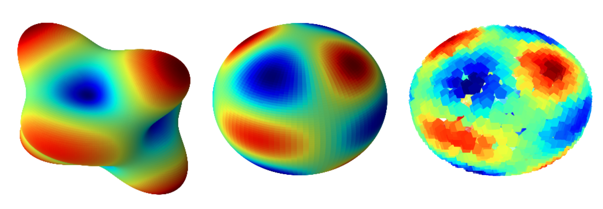

# Graph-Gaussian-Processes-Experiments

This repo provides complete model based on Matern Graph Gaussian Processes that are integrated in GPFlow. For all information about Matern Graph Gaussian Processes visit https://github.com/spbu-math-cs/Graph-Gaussian-Processes.
Model presented in this repo builds K-neighbour graph of inputs and then uses Graph Matern Kernel to build model based on graph Gaussian process.  
# Installation
```python
!pip install git+"https://github.com/AlexanderShulzhenko/Implicit-Manifold-Gaussian-Processes"
```
# Library usage
Quick guide on how to use this library:
```python
>>> from graph_gaussian_process.graph_gaussian_process_model_regression import GraphGPR
>>> train_size = 500
>>> train_ind = np.random.choice(len(X), train_size, replace=False) # X is data inputs
>>> model = GraphGPR()
>>> mean, cov = model.fit_and_predict(X,train_ind,ys) # ys correspond to X[train_ind]
```
Note that predictions are made for X inputs that are not marked as ```train_ind```.
For more detailed explanation check exaple notebooks.
# Examples
In section "Experiments" we provide notebooks for regression problems and classification problems.
